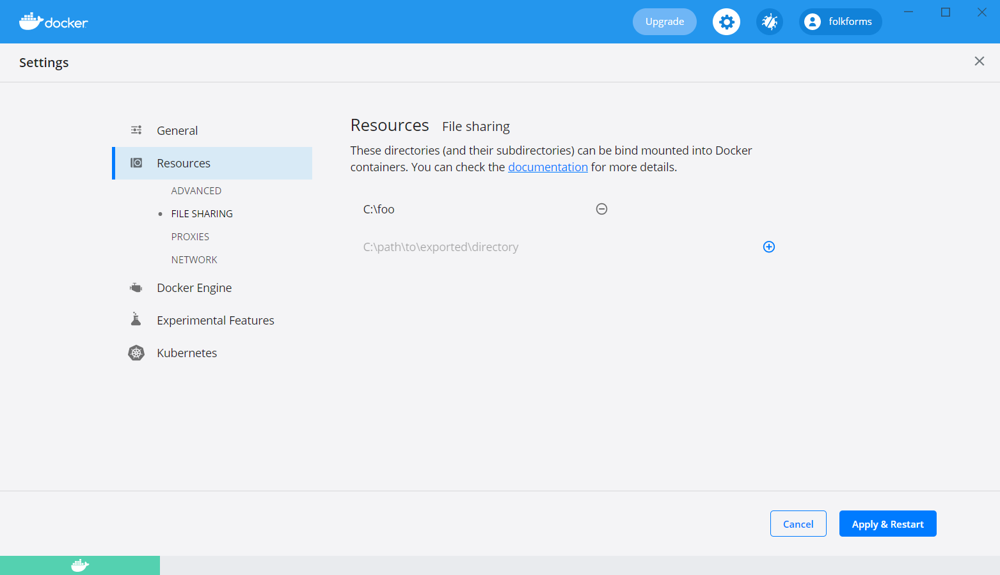

[<<< Back to home](../README.md)

# Customer guide

## Initial setup

1. Set up a 7.0.11.0 development environment.
2. Set up a V8 development environment.
3. Install Docker Desktop for [Windows](https://docs.docker.com/docker-for-windows/install/) or [Mac](https://docs.docker.com/docker-for-mac/install/).

Once installed, you will need to allow Docker Desktop to access certain paths on the local filesystem. These will be the folders that the tool will work on i.e. your SPM source code folder that will provide the input data, plus an output folder where it will write the modified data.

4. Open Docker Desktop.
5. Click Settings > Resources > File Sharing.
6. Add the folder you want to share.

## Downloading the tool

[Download options](temp_download_options.md) (WIP)

## Running the tool

1. Start the tool using `spm-ui-upgrade-helper.bat <input folder> <output folder>`.
    - `<input folder>` will be your V7 development environment.
    - `<output folder>` should be a temporary folder e.g. `c:\temp`.
    - `<output folder>` will be wiped, so be careful.
    - Note that Docker volume names MUST be absolute paths.
2. Open your browser to http://localhost:3000
3. Press `F1` or `cmd + shift + p`.
4. Type "Run SPM UI Upgrade Helper". You should see multiple available functions.
5. Click the function you want to run.
6. Wait a few minutes seconds for the tool to finish.
7. The files in `<input folder>` will be scanned and the results placed in `<output folder>`.
8. Click the `Source Control: Git` button on the left sidebar to inspect the changes.

9. Copy `<output folder>` into your V8 development environment.
10. Build and test V8.

## Additional options

In most cases, you can run this tool without modification, assuming that your SPM version is a standard installation.

If your installation is non-standard, you might need to update rules or ignore files to suit your customer environment.

### Rules

See the [rules page](customer/customer_rules.md) for steps to add new rules.

### Ignoring files

See the [ignoring files page](customer/customer_ignores.md) for steps to ignore certain files and folders.
