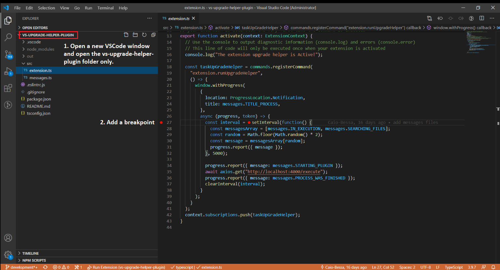
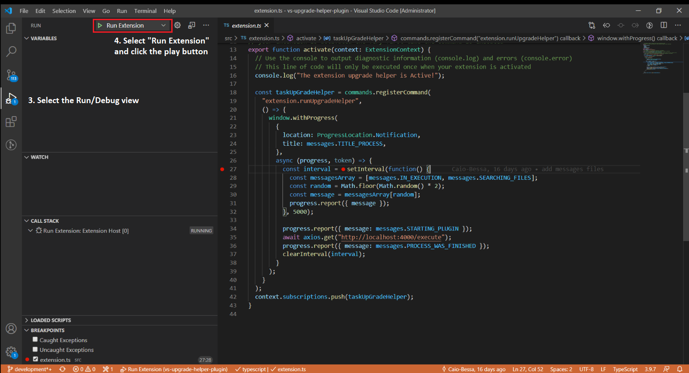
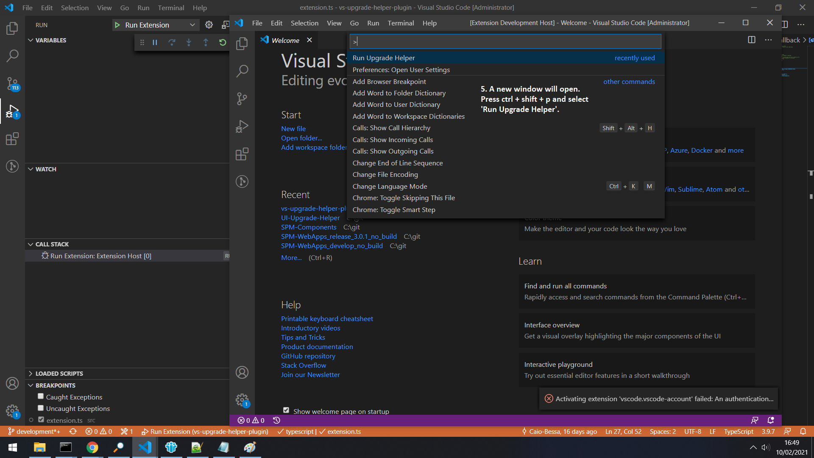
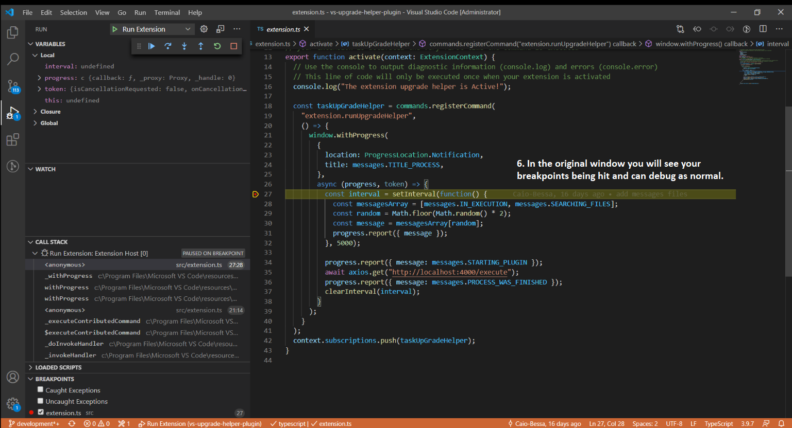

[<< Back to the developer guide](../developer_guide.md)

# Debugging

## Docker

If there is a problem with the docker container you can run one of the following commands:

    docker exec --tty --interactive spm-ui-upgrade-helper bash
    docker run  --tty --interactive --entrypoint bash spm-ui-upgrade-helper:latest

The first command will run bash in a running container, the second will start a new container.

## VSCode

1. Open a new VSCode window containing the vs-upgrade-helper-plugin folder only.
2. Add a breakpoint.

3. Select the Run/Debug view.
4. Select "Run Extension" and click the play button.

5. A new window will open. Press ctrl + shift + p and select 'Run SPM UI Upgrade Helper'.

6. In the original window you will see your breakpoints being hit and can debug as normal.

